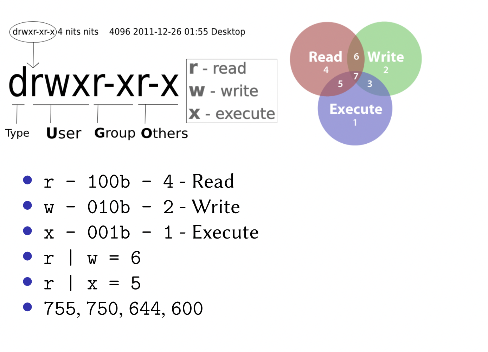

## Lectures

    - https://skelet.ludost.net/OS/KN_2018/L9c_FS_implementation_03.05.2018.webm
    - https://skelet.ludost.net/OS/KN_2018/LAa_Lift_alg_10.05.2018.webm

## Basic Commands:

### Navigation:
    - cd
    - ls
    - pwd

### File Manipulation:
    - touch
    - mkdir
    - rm
    - chown
    - cp
    - mv

### File Info:
    - stat
    - file
    - cat
    - more
    - less
    - head
    - tail
    - xxd

### Searching
    - find

### Archiving & Compressing
    - tar
    - xz

### Other
    - man
    - whoami
    - sudo
    - xargs
    - grep

## File permissions

